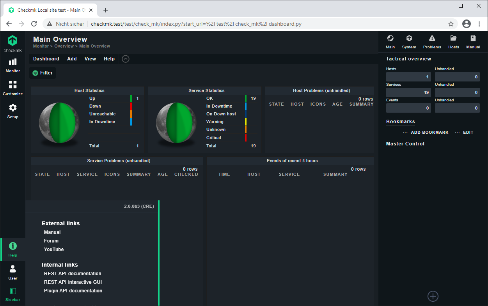

# checkmk-testing-environment

[Check_MK](https://mathias-kettner.com/check_mk.html) testing environment in a Vagrantbox based on Debian and provisioned with Ansible.

## Requirements

- Virtualbox >= 5.2.8
- Vagrant >= 2.0.1
- Vagrant Plugins:
  - vagrant plugin install vagrant-hostmanager
  - vagrant plugin install vagrant-vbguest

## Getting started

1. git clone https://github.com/neikei/check_mk-testing-environment.git
2. cd check_mk-testing-environment
3. vagrant up
4. ... wait ...
5. Open Check_MK in your web browser: http://checkmk.test/test/

## Initial credentials

The initial credentials are required for the access to the Check_MK Web GUI and shown during the provisoning.

```bash
TASK [checkmk : Get Web GUI credentials] ***************************************
changed: [default]

TASK [checkmk : Web GUI credentials] *******************************************
ok: [default] => {
    "msg": "User=cmkadmin // Password=0LeNjwjE"
}

PLAY RECAP *********************************************************************
default                    : ok=21   changed=16   unreachable=0    failed=0
```

## Local testing

A local Check_MK agent is installed. So, you can start with monitoring "127.0.0.1" to test the functionality.

- Click on "Hosts" in the "WATO - Configuration" section in the left submenu
- Click on "Create new host".
- Fill in "Hostname" and set "IPv4 Address" to "127.0.0.1"
- Click on "Save & Finish"
- Click on the orange button "1 change" and than on "Activate affected"

## Screenshot



## Feedback, Issues and Pull-Requests

Feel free to report issues, fork this project and submit pull requests.
